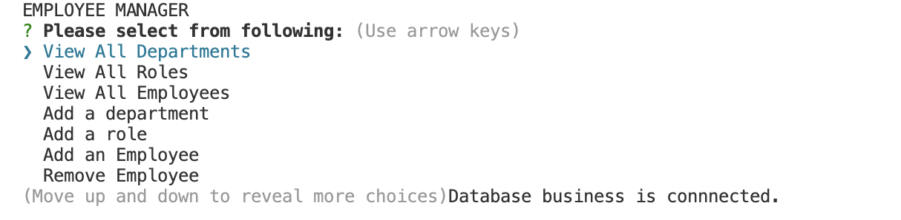
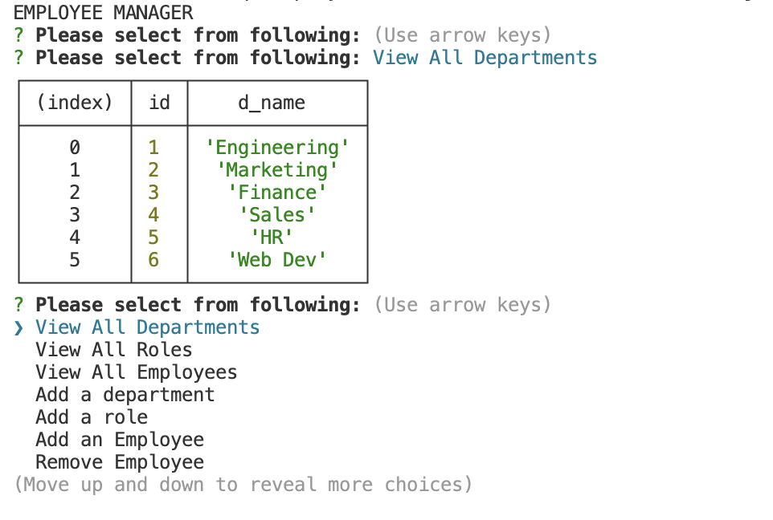

# sql-employeetracker

## Project Description

This project involved creating a command line user prompt to store data about a business. The inquirer prompt asked the end user to view all departments, view all roles, view all employees, add an employee, remove an employee, update and employee, etc. The end user is able to change the data based on the request and update the printed table of data.

## Technical Requirements

Technical requirements of this project included:
* Javascript
* README.md
* Package JSON
* Inquirer Package
* .env Package
* mySQL
* console-table-printer package

## Usage

Video Submission:https://drive.google.com/file/d/1uXMwpWzpA7uGmgXkYhH47u1YnA36SloA/view

Screenshots of Home Page:

Screenshots of Table:

Github Link: https://github.com/lavollmer/sql-employeetracker

## Credits

This project was done in conjunction with the U of MN Bootcamp 2023. 

U of MN tutoring services were used to assist with this homework. The tutor and myself discussed overall logic of project to complete the homework such as case/switch statements, inquirer.prompt, table package and connection.js files. Code was provided for connection.js by tutor; however, I used my own code after discussion (none was used). 

Case and switch logic was inspired by : https://www.w3schools.com/js/js_switch.asp

Print Table package: https://www.npmjs.com/package/console-table-printer

AskBCS was used to figure out the connection.js file with a Mac computer.

Tutor helped with code in schema.sql (this code was not used in the end): 
-- select role table title and employee table first name
SELECT r.title, e.first_name
-- from employee table --
FROM employee e
-- inner join employee table on role id with role table id and employee table role id
INNER JOIN role r ON r.id = e.role_id
-- join department table to role table --
INNER JOIN department d ON d.id = r.department_id
-- waiting for end user to determine what department --
WHERE d.id = ?